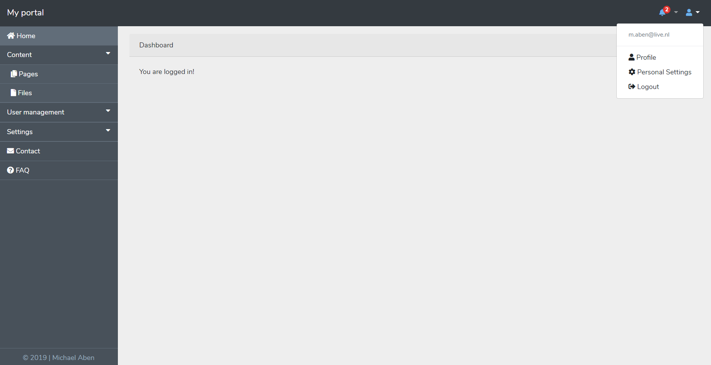

# Admin Panel For Laravel



This is a simple base to start developing your own amazing admin panel in laravel!

Nothing more than a easy to use layout with some menu's.

### Getting started
It's realy easy!

You need to require it with composer:\
`composer require maben-dev/laravel-admin-panel`

Than you need to publish the views and assets:\
`php artisan vendor:publish --provider="MabenDev\AdminPanel\AdminPanelProvider"`

After that you go to the view of your page and let it extend:\
`@extends('mabendev.adminpanel.layouts.app')`

Your page content goes in between this section:\
```
@section('content')
    // Your content goes here
@endsection
```

### Need help?
Please contact me on: m.aben@live.nl